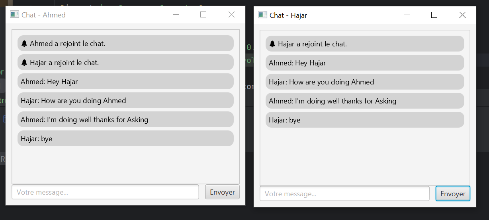

# 💬 JavaFX Multi-Client Chat Application

Une application de messagerie en **temps réel** construite avec **JavaFX**, les **sockets TCP**, et la **programmation multithread**. Chaque client peut se connecter, échanger des messages et voir les messages des autres utilisateurs avec un design moderne façon messagerie.

---

## ✨ Fonctionnalités

- 🖼️ Interface graphique stylisée avec **JavaFX**
- 🌐 Communication **temps réel** via **sockets TCP**
- 👥 Support **multi-client** avec **serveur multi-thread**
- 🟢 Messages alignés selon l’expéditeur
- 🧾 **Timestamps** pour chaque message
- 👤 Avatar avec initiale de l’utilisateur
- 🟨 Bulles de chat stylisées
- 🚪 Messages système : utilisateur connecté/déconnecté
- 🎨 Fichiers **FXML** + **CSS** pour séparation claire UI/Logique

---

## 📦 Structure du projet

```
JavaFXChatApp/
├── client/
│   ├── ChatClient.java         # Lanceur JavaFX
│   ├── WelcomeController.java  # Contrôleur de l'écran d'accueil
│   ├── ChatController.java     # Contrôleur de l'interface de chat
│   ├── welcome.fxml            # Vue FXML de bienvenue
│   ├── chat.fxml               # Vue FXML de la messagerie
│   └── style.css               # Style des bulles et UI
│
├── server/
│   ├── ServerMain.java         # Serveur multi-thread
│   └── ClientHandler.java      # Thread client individuel
│
└── README.md                   # Documentation
```

---

## 🚀 Lancement de l'application

### 🖥️ 1. Démarrer le serveur

Dans un terminal :

```bash
cd server
javac ServerMain.java ClientHandler.java
java server.ServerMain
```

Le serveur écoute par défaut sur le **port 9090**.

### 💬 2. Lancer un ou plusieurs clients

Dans un autre terminal (ou lancer plusieurs fois le client depuis votre IDE) :

```bash
cd client
javac *.java
java client.ChatClient
```

⚠️ **Chaque client ouvre une nouvelle fenêtre JavaFX indépendante**. Saisissez un **nom d’utilisateur unique** à chaque fois.

---

## 📸 Aperçu

| Écran de connexion                   | Interface de chat               |
|--------------------------------------|---------------------------------|
|  |  |

---

## 🛠️ Technologies utilisées

- Java 21 (ou 17+)
- JavaFX 21 SDK
- Sockets TCP
- Threads Java
- FXML
- CSS

---

## 📚 À savoir

- Les messages sont diffusés à **tous les clients**.
- Le serveur gère chaque client dans un **thread dédié**.
- L’interface est mise à jour avec `Platform.runLater()` pour respecter le **thread UI JavaFX**.

---

## ✅ À faire / Améliorations possibles

- 🔒 Authentification utilisateur
- 🧵 Affichage des utilisateurs connectés
- 📎 Envoi de fichiers
- 🎤 Messages vocaux
- 📲 Version mobile (avec Gluon Mobile par ex.)

---

